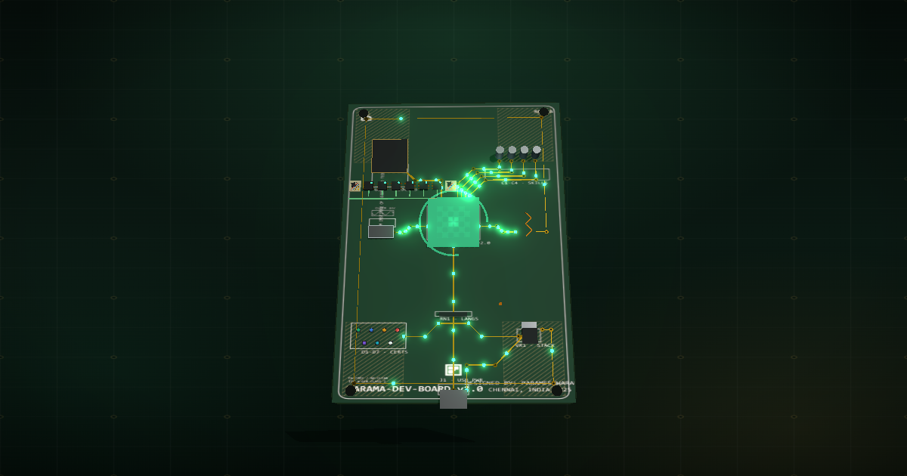

# Parameshwaran S — Portfolio

An interactive 3D PCB portfolio showcasing ECE (Electronics & Communication Engineering) + Data Science. The site is a printed circuit board: you scroll to fly a camera along the board's copper traces, and each section is a *daughterboard datasheet* docked next to its component.

**Live demo:** `npm run dev` → http://localhost:5173




## The Interaction Model

There is exactly **one** interaction model — a scroll-journey. The camera is owned by the scroll position (GSAP ScrollTrigger scrub along a Catmull-Rom spline); hover produces a raycast glow; there is no click-to-zoom.

| Mode | Who gets it | What happens |
|:---|:---|:---|
| **Scroll-Journey** (`full-journey`) | Default — viewport ≥ 768px and no `prefers-reduced-motion` | Camera flies between components as you scroll. The active section's panel activates as a pure function of the current scroll leg. |
| **Lite** (`lite-mode`) | `prefers-reduced-motion: reduce` OR viewport < 768px | No scroll-jacking — sections stack normally and are all reachable by scrolling. Hover glow still works. |

## Features

- **Scroll-journey camera flight** — a CatmullRomCurve3 path between U1 (About), U2 (Projects), C1–C4 (Skills), J1 (Experience) and the hero/contact stops; component stops use an elevated 3/4 angle so chips read with their silkscreen, and the hero/contact stops pull back far enough to frame the whole 15-unit board on any viewport.
- **Daughterboard datasheet panels** — every section panel is a physical PCB module: FR-4 glass-weave texture, four gold corner mounting holes, a gold edge-connector pad strip (via `border-image`, pinned in the border box so it never scrolls), a seated double-shadow, via-chip reference headers with fading copper traces, SMD skill pills with silver end-caps, and project cards as mini-PCBs with LED-glow status chips (green = shipped, amber flicker = building).
- **Fab-bench backdrop** — the view is never a void: a pre-rendered 1024² canvas texture (`scene.background`) paints a deep FR-4 gradient with a faint fabrication grid and plated gold vias, plus a transparent **shadow-catcher bench plane** so the board's real-time shadows land on a visible band instead of hovering in space.
- **Board-first hero** — the hero datasheet docks right (like the component sections) so the fully-framed board shows around it; it recenters below 900px where a wide panel would cover the board.
- **Deterministic boot sequence** — one GSAP timeline with all-absolute positions (no `setTimeout`, no wall-clock): laser scanline, terminal typewriter, trace/pin/LED power-on flashes, hero reveal. Return visitors skip it via `sessionStorage`; `?og=1` is an instant-capture mode for headless screenshots.
- **Shareable deep links** — every section has a URL (`#/about`, `#/projects`, …) with back/forward support; number keys 1–6 jump sections.
- **Signal-path progress** — a HUD legend fill tracks scroll progress as a pure function of position (transform-only, rAF-coalesced).
- **Exactly one LinkedIn CTA per section** — the HUD button hides whenever the active panel carries its own CTA.
- **Social card** — `public/og-preview.png` (1200×630) renders a proper LinkedIn/Discord card.
- **Accessibility & performance** — reduced-motion mode, keyboard nav, skip-to-content link, ARIA labels; FPS guardrail scales bloom below 45/30fps, raycasts throttle to every 3rd frame, backdrop is painted once.

## Setup

```bash
# 1. Install
npm install

# 2. Dev server
npm run dev            # http://localhost:5173

# 3. Production build
npm run build          # outputs to /dist

# 4. Type check (validates the // @ts-check JS modules — no .ts files in src)
npm run typecheck
```

Profile links come from Vite env vars (`VITE_LINKEDIN_URL`, `VITE_GITHUB_URL`) with public fallbacks in `src/config.js`.

LinkedIn click tracking is **off by default** (nothing loads, nothing is sent). To answer "how many visitors click Connect on LinkedIn" without conflating it with pageviews: set `VITE_PLAUSIBLE_DOMAIN` (loads Plausible, fires a named `LinkedIn CTA Click` goal — create that goal in the Plausible dashboard) or `VITE_CTA_TRACKING_ENDPOINT` (beacons a tiny POST to your own counter endpoint). See `src/utils/analytics.js`.

## Technology Stack

- **Build**: Vite (ES modules, fast HMR)
- **3D**: Three.js r185 (WebGL2) — extruded board, SMD components, copper traces, particles, bloom post-processing
- **Animation**: GSAP 3.15 + ScrollTrigger (scrubbed camera path) + ScrollToPlugin (nav)
- **Typography**: Chakra Petch (HUD, component IDs) · Fragment Mono (data, terminal) · Instrument Sans (body prose)
- **Styling**: vanilla CSS3 with a custom-property design system; CRT scanline overlays

## Project Structure

```
main.js                    # Entry point: scene init, tick loop, boot, nav, hash routing
index.html                 # HUD, boot overlay, section datasheet templates, meta/OG tags
style.css                  # Design tokens, scanlines, HUD, hero, CTA styles
scroll.css                 # Journey panel system: daughterboard cards, connector SVG
docs/claude.md             # Architecture blueprint + developer session log (read before refactoring)
src/
  config.js                # Profile URLs, lite-mode detection
  data/portfolio.js        # Data source of truth (projects, skills, timeline)
  three/scene.js           # Renderer, lights, bloom, fab-bench backdrop, shadow catcher, tick loop
  three/board.js           # Board substrate, silkscreen canvas texture, mounting holes
  three/components.js      # SMD components (U1, U2, caps, crystal, antenna, USB, LEDs…)
  three/traces.js          # Copper trace routes (TraceRoute typedef)
  three/particles.js       # Electron flow along traces
  three/project-chips.js   # Project chips (soldered vs breadboard by status)
  scroll/journey.js        # Camera path, leg-derived panel activation, screen-space anchoring
  ui/boot.js               # Deterministic boot choreography
  ui/sections.js           # Datasheet HTML from portfolio data, link wiring
  ui/fallback.js           # WebGL detection + no-WebGL fallback
  utils/hover.js           # Raycast hover glow + pointer parallax
```

## Verification Protocol

After any change:

```bash
npm run build        # must exit 0
npx tsc --noEmit     # must exit 0
npm run smoke        # must exit 0 — headless motion-invariant smoke test
```

`npm run typecheck` (`tsc --noEmit`) genuinely checks the modules opted into `// @ts-check` (`tsconfig.json` sets `allowJs: true`, `checkJs: false`): `src/scroll/journey.js`, `src/ui/boot.js`, `src/utils/hover.js`, `src/three/scene.js`, `src/three/traces.js`. Keep their JSDoc types accurate when refactoring.

`npm run smoke` (`tests/smoke-tick.mjs`) builds the real board modules into a bare THREE scene with a minimal DOM shim, registers the same tick pipeline main.js does, and drives 12000 frames asserting the motion invariants — levitation/ripple/sweep/dust/fleck bounds, hover-shadow opacity+scale bounds, D1-D7 LED pulse bounds, ambient signal-pulse position bounds, idle-drift offset bounds + determinism, zero NaN across the graph, wake-in starts at y:0, and `motionPrefs.reduced` forces everything static. It also exercises the **raycast layer** headlessly: a real camera + the app's own `initHover`/`checkHover` driven through the DOM mousemove path must hit the component under the cursor across a sweep of six camera poses (asserts the canvas-rect pointer→NDC conversion and the raycast pipeline together). Run it after touching any motion module. **Excluded modules**: `updateProbe` (needs activation), `updateJourneyEffects` (DOM panel/connector), `updateIdleDrift`'s camera compose (the headless scene has no camera — its pure offset is asserted directly instead).

## Customization

- **Profile data** — `src/data/portfolio.js` (projects, skills, experience, stats)
- **Colors** — CSS custom properties in `style.css` (`--mask-green`, `--enif-gold`, `--signal-green`, …)
- **Boot text / timing** — `SCHEDULE` + `BOOT_LINES` in `src/ui/boot.js`
- **Camera path** — `PATH` stops/vias in `src/scroll/journey.js`; `FIXED_CAMERAS` for hero/contact framing
- **Social card** — regenerate `public/og-preview.png` via the local headless-capture pipeline in `.freebuff/og-tools` (gitignored, `?og=1` capture mode)
